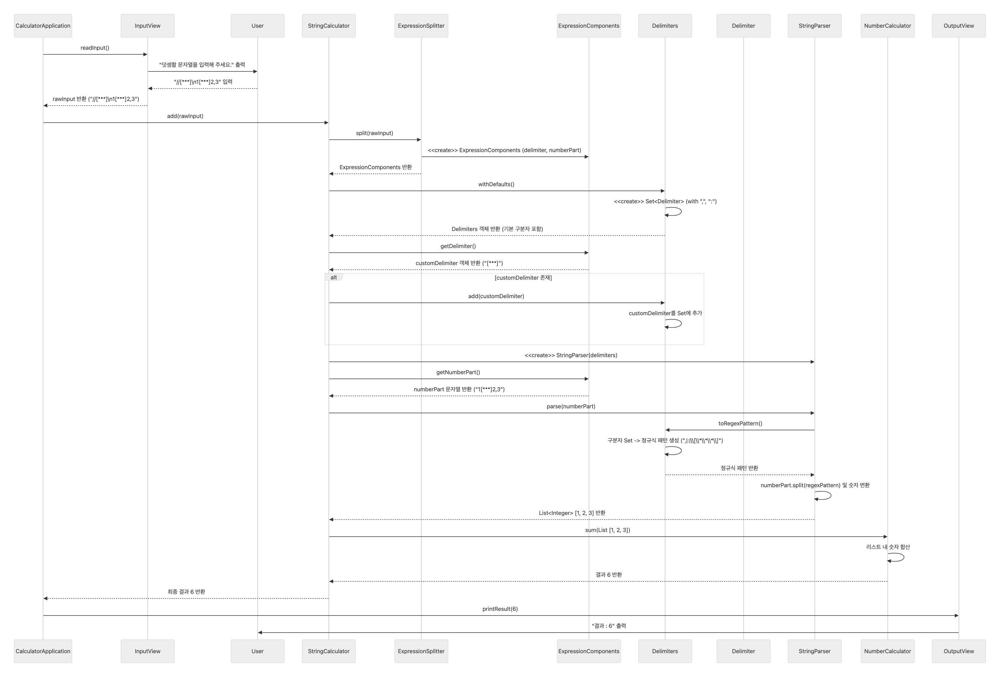

### 🌟 전체 메시지 흐름 

1.  **`CalculatorApplication`**: 애플리케이션의 시작과 끝, 그리고 객체 간의 흐름을 총괄합니다.

2.  **`CalculatorApplication` → `InputView`**: `readInput()` 메시지를 보내 사용자 입력을 요청합니다.

3.  **`InputView` → 사용자**: 화면에 `"덧셈할 문자열을 입력해 주세요."`를 출력합니다.

4.  **사용자 → `InputView`**: 예를 들어, `"//[***]\n1[***]2,3"`을 입력합니다.

5.  **`InputView` → `CalculatorApplication`**: 입력받은 원본 문자열(`rawInput`) `"//[***]\n1[***]2,3"`을 반환합니다.

6.  **`CalculatorApplication` → `StringCalculator`**: `add("//[***]\n1[***]2,3")` 메시지를 보내 계산을 지시합니다.

7.  **`StringCalculator` → `ExpressionSplitter`**: `split("//[***]\n1[***]2,3")` 메시지를 보내 문자열 분리를 요청합니다.

8.  **`ExpressionSplitter` → `StringCalculator`**: `ExpressionComponents` 객체 (내부: `Delimiter` 객체, `numberPart` 문자열)를 반환합니다.

9.  **`StringCalculator`**: `Delimiters.withDefaults()`를 호출하여 **기본 구분자(`,` , `:`)가 포함된 `Delimiters` 객체를 생성**합니다.

10. **`StringCalculator`**: `ExpressionComponents`에서 추출한 커스텀 `Delimiter` 객체를 `Delimiters` 객체에 **추가**합니다. `delimiters.add(customDelimiter)`

11. **`StringCalculator`**: 완성된 `Delimiters` 객체를 주입하여 `StringParser`를 생성합니다.

12. **`StringCalculator` → `StringParser`**: `parse("1[***]2,3")` 메시지를 보냅니다.

13. **`StringParser` → `Delimiters`**: `toRegexPattern()` 메시지를 보내 파싱에 사용할 정규식을 요청합니다.

14. **`Delimiters` → `StringParser`**: 내부의 모든 구분자를 조합하여 만든 최종 정규식 패턴(예: `,|:|\[\*\*\*\]`)을 반환합니다.

15. **`StringParser`**: 전달받은 정규식으로 `numberPart`를 파싱하여 `List<Integer>` `[1, 2, 3]`을 만듭니다.

16. **`StringParser` → `StringCalculator`**: `List<Integer>` `[1, 2, 3]`을 반환합니다.

17. **`StringCalculator` → `NumberCalculator`**: `sum(List [1, 2, 3])` 메시지를 보내 덧셈을 요청합니다.

18. **`NumberCalculator` → `StringCalculator`**: 리스트의 모든 숫자를 더한 결과값 `6`을 반환합니다.

19. **`StringCalculator` → `CalculatorApplication`**: 최종 계산 결과 `6`을 반환합니다.

20. **`CalculatorApplication` → `OutputView`**: `printResult(6)` 메시지를 보내 출력을 요청합니다.

21. **`OutputView` → 사용자**: 화면에 최종 결과 `"결과 : 6"`을 출력합니다.

